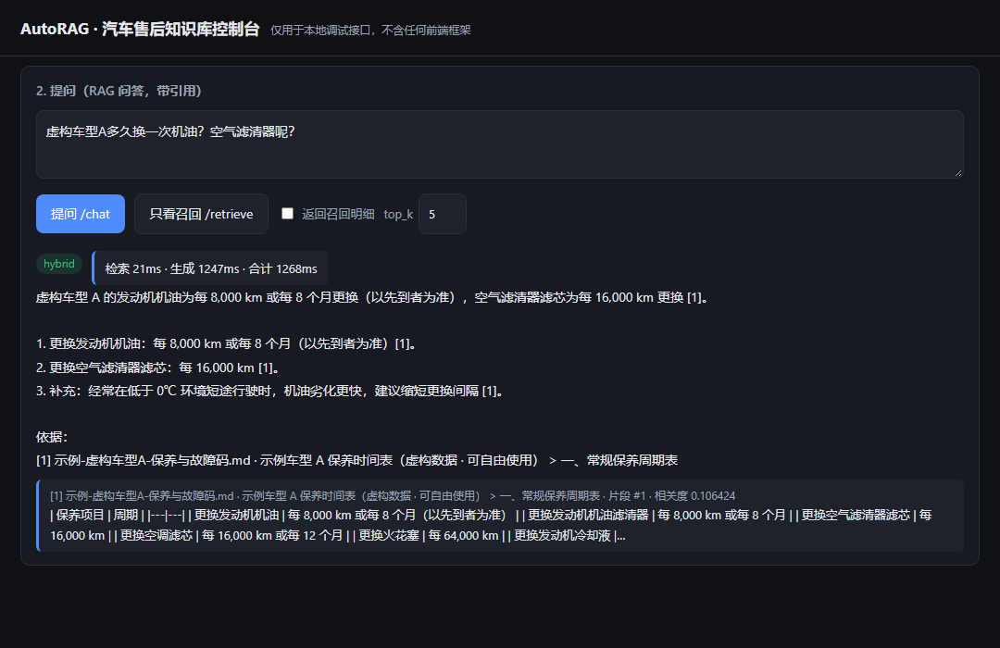
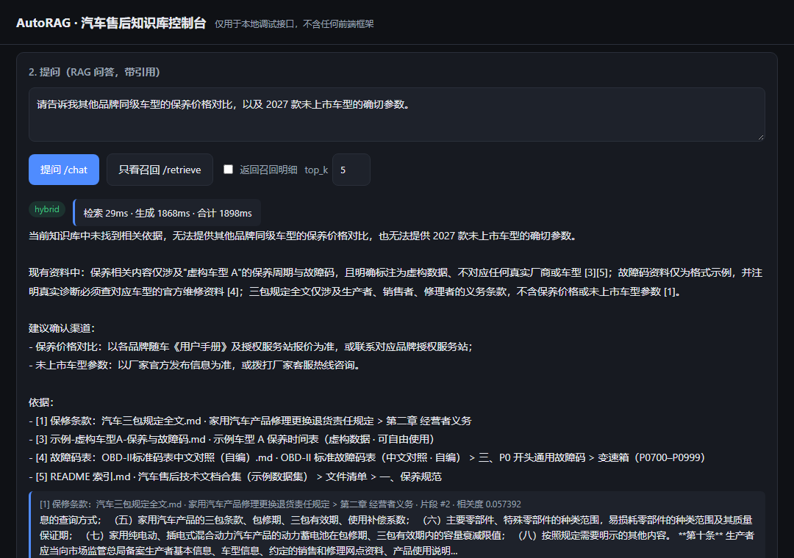

# AutoRAG · 汽车售后 RAG 知识库问答系统

> 一个**可运行、可复现、可讲清**的 RAG 后端：文档切分入库 → 向量 + BM25 混合检索 → 生成**带引用来源**的回答。
> FastAPI · Chroma · 本地 BGE 向量 · 自研 BM25 · Docker

**它和"直接问大模型"的区别**：每个结论都必须给出处（`[1]` 角标 + 依据列表），
服务端会校验引用编号是否越界；**检索不到依据时不调用大模型**，直接说明"未找到"并给确认渠道，
从源头掐掉无依据生成。

---

## 30 秒看懂这个项目

| 你可能关心 | 这个项目怎么做的 |
| --- | --- |
| 只会调 API，不懂检索？ | 向量召回 + **自研 BM25**（零依赖，中英文混合分词）→ **RRF 融合** → **多信号重排**，每一环都能单独观测 |
| 模型瞎编参数怎么办？ | 提示词硬约束 + **服务端引用越界校验** + 无依据时**不调用模型**，三层兜底 |
| 表格、故障码这类结构化内容会被切坏？ | Markdown 表格作为**原子块**处理，超长表按行切并**逐片重复表头** |
| 怎么知道是不是真能跑？ | 30 项纯逻辑断言 + 启动自检脚本 + 评测脚本，全部可一条命令复现 |
| 遇到问题怎么定位？ | `/retrieve` 只做检索不花 token；响应里带 `latency` 拆解与 `warnings` |

**效果示例**（以下为真实运行截图，基于仓库内 `data/documents/` 的示例数据集）

**① 正常问答**：结论 + `[n]` 角标 + 依据列表 + 命中的原文片段，右上角还有检索/生成耗时拆解



**② 无依据时拒答**：明确说"未找到"，指出资料里有什么、没有什么，并给出确认渠道



> 截图里的界面就是项目内置的控制台（`http://127.0.0.1:8000/`），不是示意图。
> 控制台支持 `?q=问题&autorun=1&shot=1` 参数自动提问并进入截图模式，例如
> `http://127.0.0.1:8000/?shot=1&autorun=1&q=虚构车型A多久换一次机油` —— 你也可以一键复现这两张图。

<details>
<summary>展开查看第 ① 张图的文字版（便于检索与复制）</summary>

```text
问：虚构车型A多久换一次机油？空气滤清器呢？

答：虚构车型 A 的发动机机油为每 8,000 km 或每 8 个月更换（以先到者为准），
    空气滤清器滤芯为每 16,000 km 更换 [1]。

    1. 更换发动机机油：每 8,000 km 或每 8 个月（以先到者为准）[1]。
    2. 更换空气滤清器滤芯：每 16,000 km [1]。
    3. 补充：经常在低于 0℃ 环境短途行驶时，机油劣化更快，建议缩短更换间隔 [1]。

    依据：
    [1] 示例-虚构车型A-保养与故障码.md · 示例车型 A 保养时间表（虚构数据 · 可自由使用） > 一、常规保养周期表
```

</details>

<details>
<summary>展开查看第 ② 张图的文字版</summary>

```text
问：请告诉我其他品牌同级车型的保养价格对比，以及 2027 款未上市车型的确切参数。

答：当前知识库中未找到相关依据，无法提供其他品牌同级车型的保养价格对比，
    也无法提供 2027 款未上市车型的确切参数。
    现有资料中：保养相关内容仅涉及"虚构车型 A"的保养周期与故障码，且明确标注为虚构数据；
    故障码资料仅为格式示例，并注明真实诊断必须查对应车型的官方维修资料；
    三包规定全文仅涉及生产者、销售者、修理者的义务条款，不含保养价格或未上市车型参数。

    建议确认渠道：
    - 保养价格对比：以各品牌随车《用户手册》及授权服务站报价为准；
    - 未上市车型参数：以厂家官方发布信息为准。

    （响应里 refused 字段与 warnings 会标明本次是否走了兜底 / 是否存在越界引用）
```

</details>

---

## 快速开始（不填任何 Key 也能先验证检索链路）

```bash
# 1) 安装依赖（Python 3.10+；Chromadb 版本说明见第 3 节）
python -m venv .venv
.venv\Scripts\Activate.ps1          # Linux/macOS: source .venv/bin/activate
pip install -r requirements.txt

# 2) 准备配置并自检（默认 EMBEDDING_PROVIDER=hash，无需任何 Key）
copy .env.example .env               # Linux/macOS: cp .env.example .env
python scripts/preflight.py          # 期望：阻塞项 0 / 问题项 0
python tests/smoke_test.py           # 期望：通过 30 项 / 失败 0 项

# 3) 启动并入库示例知识库
uvicorn app.main:app --reload --port 8000
#   → 内置调试控制台： http://127.0.0.1:8000/
#   → 接口文档：       http://127.0.0.1:8000/docs
python scripts/ingest.py --rebuild
```

到这里**检索链路**（加载 → 切分 → 向量化 → 入库 → 混合检索）就验证完了，零 token 消耗。
要让它在检索结果基础上**生成答案**，只需在 `.env` 填 `LLM_API_KEY`（任何 OpenAI 兼容服务），
再按第 [3.3 节](#33-第二步填-key切换成真正的语义检索) 切换向量模型即可。

```bash
# 只测召回、不花 token
python scripts/run_eval.py --mode retrieve --limit 5
# 完整问答评测（消耗 token）
python scripts/run_eval.py --limit 5
```

---

> **关于效果与验证状态的说明（请先读）**
> 本项目的**代码、依赖安装、服务启动、入库、检索、问答、流式、评测**均已在
> Windows + Python 3.13.9 上实际执行验证，结果记录在 [12. 实测记录](#12-实测记录诚实版只记录真实执行过的内容)。
> 但请注意：这些是**单机、单次、小样本**的真实执行结果，**不是准确率、召回率、QPS 或性能基准**，
> 也没有与任何其他系统做对比。所有需要你补齐的密钥、路径、知识库内容与评测答案，
> 统一用 `[待补充]` 标注。你自己跑出来的数字才是你的环境下的真实结果。
>
> 已知的检索失败样例也如实记录在
> [12.2 节](#122-第三轮换成可公开的示例数据集后的复测含未解决的失败样例)（9 条查询：第 1 名命中 7/9、前 3 名 8/9），
> 并说明了为什么继续调权重没有意义。

> **用途与数据来源声明**
> 本项目用于**技术学习与求职作品集展示**，不公开部署在线服务。
> 仓库内示例文档为**虚构数据**（`data/documents/示例-虚构车型A-保养与故障码.md`）
> 或**不受著作权保护的法律法规全文**。项目不代表任何汽车厂商官方口径，
> 不构成维修或保养建议。若你要放入自己的真实文档：本地学习研究属合理使用，
> 但**公开提供检索属于信息网络传播行为**，需自行确认授权范围。
> 发布前请先跑 `python scripts/publish_check.py`，详见 [portfolio.md](portfolio.md)。

> **许可协议**
> 代码采用 [MIT License](LICENSE)，可自由使用、修改、分发。
> `data/documents/` 下的示例文档授权情况单独说明在 [NOTICE](NOTICE)：
> 虚构示例文档与自编码表对照表由作者构造（按 MIT）；
> 法规全文来自政府公开渠道，依《著作权法》第五条不受著作权保护。

---

## 1. 这个项目有什么（面试可讲的技术点）

| 能力 | 实现方式 | 对应代码 |
| --- | --- | --- |
| 结构感知切分 | 标题层级 + 段落 + 句子三级兜底；**Markdown 表格作为原子块**、超长表按行切并逐片重复表头 | `app/core/chunker.py` |
| 多格式加载 | `.md/.markdown/.txt` 内置；`.pdf/.docx` 走可选依赖，缺失时给出安装提示而不是崩溃 | `app/core/loader.py` |
| 向量库 | Chroma `PersistentClient` 落盘，cosine 距离，**显式传入自己算的向量**（不依赖 Chroma 默认模型下载） | `app/core/vector_store.py` |
| 混合检索 | 向量召回 + 自研 BM25（零依赖、中英文混合分词含中文 bigram）→ RRF 融合 → 四信号重排（融合分/词覆盖/高精度串/整句命中） | `app/core/bm25.py`、`app/core/retriever.py` |
| Embedding 可切换 | `api`（OpenAI 兼容）/ `local`（sentence-transformers）/ `hash`（零依赖，仅验证链路） | `app/core/embedding.py` |
| 带引用回答 | 资料按 `[n]` 编号注入提示词，回答必须带角标；服务端校验角标是否越界 | `app/services/rag_pipeline.py` |
| 无依据兜底 | 检索为空或（纯向量模式下）相似度低于阈值时**不调用大模型**，直接返回确认渠道 | 同上 `should_refuse` |
| 增量入库 | `data/registry.json` 记录 checksum，未变更文件跳过；磁盘删除的文档同步清理 | `app/services/ingestion_service.py` |
| 可观测 | `/health`、`/stats`、每次问答返回 `latency` 拆解（检索/生成/合计）与 token 用量 | `app/api/routes_system.py` |
| 评测闭环 | 20 条评测集模板 + HTTP 接口评测 + 独立脚本，输出 JSON/Markdown 报告 | `eval/eval_set.json`、`scripts/run_eval.py` |
| 交付 | Dockerfile（非 root + healthcheck + tini）、docker-compose.yml、内置零依赖调试控制台 | `Dockerfile`、`app/web/console.html` |

---

## 2. 目录结构

```text
AutoRAG/
├── app/
│   ├── main.py                  # FastAPI 入口：lifespan 装配、路由挂载、GET /api/v1/ask、调试控制台
│   ├── config.py                # .env -> Settings（含占位符检测、路径解析、启动自检）
│   ├── models.py                # Pydantic 数据契约（请求/响应/引用/评测集）
│   ├── logging_conf.py          # 日志统一格式
│   ├── api/
│   │   ├── deps.py              # ServiceContainer 与依赖注入、可选 X-API-Key 校验
│   │   ├── routes_system.py     # /health /stats /sources /version DELETE /collection
│   │   ├── routes_ingest.py     # /ingest /ingest/upload
│   │   ├── routes_qa.py         # /retrieve /chat /chat/stream /chunks/preview
│   │   └── routes_eval.py       # /eval/dataset /eval/run /eval/reports
│   ├── core/
│   │   ├── text_utils.py        # 归一化、分句、中英混合分词、哈希、摘要
│   │   ├── chunker.py           # 三级切分 + 重叠 + 章节路径
│   │   ├── loader.py            # 文档读取（md/txt/pdf/docx）
│   │   ├── embedding.py         # api / local / hash 三种 embedder
│   │   ├── vector_store.py      # Chroma 封装
│   │   ├── bm25.py              # 自研 BM25 + JSON 持久化
│   │   ├── retriever.py         # 向量 + BM25 + RRF 融合 + 重排
│   │   └── llm_client.py        # OpenAI 兼容客户端（同步 + SSE 流式 + 重试）
│   ├── services/
│   │   ├── container.py         # 组件装配（失败降级不崩服务）
│   │   ├── ingestion_service.py # 扫描/增量/删除/BM25 重建
│   │   ├── rag_pipeline.py      # 提示词、引用组装、校验、兜底
│   │   └── eval_service.py      # 评测运行与报告落盘
│   └── web/
│       └── console.html         # 内置调试页（打开 http://127.0.0.1:8000/ 即用）
├── eval/
│   ├── eval_set.json            # 20 条评测集模板（答案位置为 [待补充]）
│   └── results/                 # 评测报告输出目录（自动创建）
├── scripts/
│   ├── preflight.py             # 启动前自检：一条命令定位环境/配置/依赖问题
│   ├── ingest.py                # 命令行入库（调 HTTP 接口，保证三处状态一致）
│   ├── run_eval.py              # 命令行评测（纯标准库，输出 JSON + Markdown）
│   └── publish_check.py         # 作品集发布前检查（密钥/文档侵权风险/运行时产物）
├── resume/                      # 求职材料（面试问答、演示脚本）—— 已被 .gitignore 排除，勿公开
├── portfolio.md                 # 作品集发布说明（脱敏步骤、仓库结构建议、声明模板）
├── data/
│   ├── documents/               # 你的知识库文档放这里
│   ├── chroma/                  # 向量库持久化（自动生成）
│   ├── uploads/                 # 上传文件落地（自动生成）
│   ├── registry.json            # 增量入库记录（自动生成）
│   └── bm25_index.json          # BM25 索引（自动生成）
├── tests/smoke_test.py          # 冒烟测试（无需大模型，验证切分/BM25/融合逻辑）
├── .env.example                 # 环境变量模板（复制为 .env 后填写）
├── requirements.txt             # 核心依赖
├── requirements-local.txt       # 可选：本地向量模型
├── Dockerfile
├── docker-compose.yml
├── docs/
│   └── images/                  # README 用的真实运行截图
├── LICENSE                      # MIT
├── NOTICE                       # 示例文档的来源与授权说明
└── README.md
```

---

## 3. 完整安装与配置步骤

> 如果你已经按开头「快速开始」跑通了检索链路，可以直接跳到 [3.3 节](#33-第二步填-key切换成真正的语义检索)
> 配置对话模型；本节其余内容是给第一次接触本项目的人准备的完整说明。

### 3.1 环境要求

- Python **3.10+**（开发时按 3.11 编写；容器镜像用 `python:3.11-slim`）
- 可访问外网（下载依赖、调用 LLM API）
- 不需要本地 GPU

### 3.2 第一步：跑通检索链路（不填任何 Key）

开头的「快速开始」三步已经覆盖了安装、自检与入库。这里补充**验证清单**——
做完这三步，链路（加载 → 切分 → 向量化 → 入库 → 混合检索）就算验证完成：

| 验证项 | 命令 | 期望结果 |
| --- | --- | --- |
| 环境与配置 | `python scripts/preflight.py` | 阻塞项 0、问题项 0 |
| 纯逻辑正确性 | `python tests/smoke_test.py` | 通过 30 项、失败 0 项 |
| 入库 | `python scripts/ingest.py --rebuild` | `indexed=6`、`total_chunks_in_store=87` |
| 召回（零 token） | 见下方 curl | 返回结果里同时带 `vector_score` 与 `keyword_score` |
| 批量召回评测（零 token） | `python scripts/run_eval.py --mode retrieve` | 跑通并生成 JSON + Markdown 报告 |

```bash
# 只看向量召回与 BM25 融合结果，不调用大模型、不消耗 token
curl -X POST http://127.0.0.1:8000/api/v1/retrieve ^
  -H "Content-Type: application/json" ^
  -d "{\"query\":\"虚构车型A多久换一次机油\"}"
```

此时 `/api/v1/health` 会显示 `llm_ready=false`（因为 `LLM_API_KEY` 还是 `[待补充]`），
这是**预期行为**：健康检查会如实报告未配置，而不是假装正常。

> **Python 版本注意事项（实测踩过的坑）**
> `chromadb` 0.5.x 依赖 `chroma-hnswlib`，而它**只发布了到 cp311 的 Windows wheel**，
> 所以在 Python 3.12 / 3.13 上会退化成源码编译，并报
> `Microsoft Visual C++ 14.0 or greater is required`。
> 本项目因此在 `requirements.txt` 里固定 `chromadb>=1.0,<2.0`（提供 cp39-abi3 预编译 wheel，
> Python 3.9+ 直接可装），并已在 Python 3.13.9 上实测通过。
> 如果你必须用 0.5.x，请改用 **Python 3.11** 解释器。

只有"生成答案 + 引用"这一段需要 LLM Key，见下一节。

### 3.3 第二步：填 Key，切换成真正的语义检索

编辑 `.env`：

```dotenv
# 对话模型（示例为 DeepSeek，其它 OpenAI 兼容服务同理）
LLM_API_KEY=[待补充]                 # 换成你的真实 Key
LLM_BASE_URL=https://api.deepseek.com/v1
LLM_MODEL=deepseek-chat

# 向量模型：改掉 provider，并填写三要素 + 维度
EMBEDDING_PROVIDER=api
EMBEDDING_API_KEY=[待补充]
EMBEDDING_BASE_URL=[待补充]          # 形如 https://xxx/v1
EMBEDDING_MODEL=[待补充]             # 形如 text-embedding-3-small / bge-m3
EMBEDDING_DIM=[待补充]               # 与模型输出维度一致，例如 1536 / 1024
```

改完**必须重建向量库**，因为新旧向量不在同一空间：

```bash
python scripts/ingest.py --rebuild
```

### 3.4 第三步：放入你的知识库文档

把文档放进 `data/documents/`（可用子目录，来源标识为相对路径，例如 `保养/周期表.md`），然后：

```bash
python scripts/ingest.py            # 增量入库
python scripts/ingest.py --rebuild  # 全量重建
```

### 3.5 第四步：提问题

```bash
curl -X POST http://127.0.0.1:8000/api/v1/chat ^
  -H "Content-Type: application/json" ^
  -d "{\"question\":\"更换机油后需要复位保养提醒吗？\",\"debug\":true}"
```

（Linux/macOS 把 `^` 换成 `\` 并把内层引号改为单引号。）

---

## 4. 接口一览

所有业务接口前缀 `/api/v1`。若 `.env` 里配置了 `API_KEY`，除 `/health` 外都需要请求头
`X-API-Key: <你的值>`；不配置则不需要鉴权（本地开发默认如此）。

| 方法 | 路径 | 说明 |
| --- | --- | --- |
| GET | `/api/v1/health` | 健康检查。`?probe_llm=true` 会真实调用一次 LLM（max_tokens=1） |
| GET | `/api/v1/stats` | 知识库统计：片段数、已索引文档数、BM25 规模、配置告警 |
| GET | `/api/v1/sources` | 列出向量库中已有的来源文件 |
| GET | `/api/v1/version` | 版本与配置指纹 |
| DELETE | `/api/v1/collection` | 清空向量库与 BM25 索引（不会删除原始文档） |
| POST | `/api/v1/ingest` | 扫描 `data/documents` 增量入库；`{"rebuild":true}` 全量重建 |
| POST | `/api/v1/ingest/upload` | 上传单个文档；`?auto_ingest=true` 时立即入库 |
| POST | `/api/v1/retrieve` | **只检索**，不调用大模型（用于单独评估召回质量） |
| POST | `/api/v1/chat` | 完整问答，返回 `answer` + `citations` + `latency` + `usage` |
| POST | `/api/v1/chat/stream` | SSE 流式问答：先 `meta` 事件（含引用），再 `token`，最后 `done` |
| GET | `/api/v1/ask` | GET 版问答，便于浏览器或 curl 直接试 |
| GET | `/api/v1/chunks/preview` | 预览向量库中的少量片段（人工抽查切分质量） |
| GET | `/api/v1/eval/dataset` | 查看评测集概况与待补充字段 |
| POST | `/api/v1/eval/run` | 运行评测集（**会消耗 token**），报告落盘到 `eval/results/` |
| GET | `/api/v1/eval/reports` | 列出历史评测报告 |

### 4.1 `/api/v1/chat` 请求/响应示例

请求：

```json
{
  "question": "首保应该在多少公里或多长时间内进行？",
  "top_k": 5,
  "retrieval_mode": "hybrid",
  "debug": true
}
```

响应（字段结构如下；具体内容取决于你的知识库与模型）：

```json
{
  "question": "首保应该在多少公里或多长时间内进行？",
  "answer": "……（模型输出，每处结论带 [1] 这类角标）……\n\n依据：\n[1] 保养周期.md · 保养 > 首保",
  "citations": [
    {
      "index": 1,
      "chunk_id": "doc_xxxxxxxxxx::3",
      "source": "保养周期.md",
      "title": "保养周期",
      "section": "保养 > 首保",
      "position": 3,
      "score": 0.0,
      "snippet": "……"
    }
  ],
  "retrieved": [],
  "refused": false,
  "retrieval_mode": "hybrid",
  "model": "deepseek-chat",
  "latency": { "retrieve_ms": 0, "generate_ms": 0, "total_ms": 0 },
  "usage": { "prompt_tokens": 0, "completion_tokens": 0, "total_tokens": 0 },
  "warnings": []
}
```

`warnings` 值得关注，它会在这些情况下出现（服务端如实报告，不掩盖）：

- 模型给出的 `[n]` 超出了实际资料编号范围 → `引用编号越界`；
- 模型一个角标都没打 → 提示可能未遵循引用格式，`citations` 会退化为全部召回来源；
- 检索为空但 `REFUSE_WHEN_EMPTY=false` → 提示回答可能无依据；
- `EMBEDDING_PROVIDER=hash` → 提示当前不具备真正的语义检索能力。

### 4.2 流式调用示例（Python）

```python
import json
import httpx

with httpx.stream(
    "POST",
    "http://127.0.0.1:8000/api/v1/chat/stream",
    json={"question": "刹车片磨损到多少毫米需要更换？"},
    timeout=120.0,
) as response:
    for line in response.iter_lines():
        if not line:
            continue
        if line.startswith("event:"):
            event = line.split(":", 1)[1].strip()
        elif line.startswith("data:"):
            payload = json.loads(line.split(":", 1)[1].strip())
            if event == "meta":
                print("引用来源：", [c["source"] for c in payload["citations"]])
            elif event == "token":
                print(payload["text"], end="", flush=True)
            elif event == "done":
                print("\n", payload)
```

> 流式模式**不做**服务端引用越界校验（回答还在生成中），前端拼接完成后如需校验请改用
> `POST /api/v1/chat`。这一点在 `done` 事件里也会明确提示。

---

## 5. 环境变量清单

复制 `.env.example` → `.env` 后按需修改。`[待补充]` 表示必须由你填写的项。

| 变量 | 默认值 | 是否必填 | 说明 |
| --- | --- | --- | --- |
| `LLM_API_KEY` | `[待补充]` | **是**（问答功能） | 对话模型密钥 |
| `LLM_BASE_URL` | `https://api.deepseek.com/v1` | 是 | OpenAI 兼容地址，需含 `/v1` |
| `LLM_MODEL` | `deepseek-chat` | 是 | 模型名 |
| `LLM_TIMEOUT_SECONDS` | `60` | 否 | 单次请求超时 |
| `LLM_MAX_RETRIES` | `3` | 否 | 失败重试次数（429/5xx/网络错误才重试） |
| `LLM_TEMPERATURE` | `0.2` | 否 | 建议保持低温度，减少自由发挥 |
| `LLM_MAX_TOKENS` | `1024` | 否 | 单次生成上限 |
| `EMBEDDING_PROVIDER` | `hash` | 是 | `api` / `local` / `hash`，正式使用请选 `api` |
| `EMBEDDING_API_KEY` | `[待补充]` | provider=api 时必填 | 向量模型密钥 |
| `EMBEDDING_BASE_URL` | `[待补充]` | provider=api 时必填 | 向量接口地址（含 `/v1`） |
| `EMBEDDING_MODEL` | `[待补充]` | provider=api 时必填 | 向量模型名 |
| `EMBEDDING_DIM` | `[待补充]` | provider=api 时必填 | 向量维度，须与模型一致 |
| `LOCAL_EMBEDDING_MODEL` | `[待补充]` | provider=local 时必填 | 本地模型名或本地目录路径 |
| `LOCAL_EMBEDDING_DIM` | `[待补充]` | 否 | 留空则由模型自动推断 |
| `HASH_EMBEDDING_DIM` | `1024` | 否 | hash 模式向量维度 |
| `DOCUMENTS_DIR` | `./data/documents` | 否 | 知识库目录（相对项目根目录解析） |
| `CHROMA_DIR` | `./data/chroma` | 否 | 向量库落盘目录 |
| `UPLOAD_DIR` | `./data/uploads` | 否 | 上传文件目录 |
| `REGISTRY_PATH` | `./data/registry.json` | 否 | 增量索引记录 |
| `BM25_INDEX_PATH` | `./data/bm25_index.json` | 否 | BM25 索引落盘位置 |
| `CHROMA_COLLECTION` | `auto_after_sales` | 否 | 集合名 |
| `CHUNK_SIZE` | `600` | 否 | 目标片段字符数 |
| `CHUNK_OVERLAP` | `80` | 否 | 相邻片段重叠字符数（代码内保证 < CHUNK_SIZE） |
| `CHUNK_MIN_CHARS` | `80` | 否 | 小于该长度的碎块并入前一块 |
| `RETRIEVAL_MODE` | `hybrid` | 否 | `vector` / `keyword` / `hybrid` |
| `RRF_K` | `60` | 否 | RRF 融合常数 |
| `VECTOR_WEIGHT` | `1.0` | 否 | 融合中向量通道权重 |
| `KEYWORD_WEIGHT` | `0.8` | 否 | 融合中 BM25 通道权重 |
| `TOP_K` | `5` | 否 | 最终喂给模型的片段数 |
| `CANDIDATE_K` | `20` | 否 | 每路召回候选数 |
| `MIN_SCORE` | `0.05` | 否 | 仅 `RETRIEVAL_MODE=vector` 时生效的拒答阈值 |
| `REFUSE_WHEN_EMPTY` | `true` | 否 | 检索为空时是否跳过 LLM 直接兜底 |
| `API_HOST` / `API_PORT` | `0.0.0.0` / `8000` | 否 | 监听地址与端口 |
| `API_KEY` | 空 | 否 | 填了才启用 `X-API-Key` 校验 |
| `CORS_ORIGINS` | `*` | 否 | 允许的跨域来源，逗号分隔 |
| `MAX_UPLOAD_MB` | `20` | 否 | 上传大小上限 |
| `LOG_LEVEL` | `INFO` | 否 | 日志级别 |

---

## 6. 评测集与评测方式

### 6.1 评测集模板

[eval/eval_set.json](eval/eval_set.json) 提供 **20 条**汽车售后场景问题，覆盖：
保养周期、油液规格、易损件、故障码、电气/蓄电池、轮胎胎压、季节性检查、
使用与应急、故障诊断、保修条款与索赔流程，以及 **1 条负样本**（用于检验系统是否拒答）。

每条字段含义：

| 字段 | 说明 |
| --- | --- |
| `id` | 唯一编号 |
| `category` | 分类，便于按维度看结果 |
| `question` | 用户问题 |
| `ground_truth` | 标准答案，**需要你按真实资料填写**（`[待补充]`）；只用于人工复核，不参与自动打分 |
| `expected_sources` | 期望命中的来源文件（`data/documents` 下的相对路径），用于"来源命中"统计 |
| `expected_keywords` | 答案中必须出现的字面串（数值、部件名、故障码），用于关键词覆盖率 |
| `must_refuse` | `true` 表示知识库无依据，期望系统拒答 |
| `notes` | 该条想考察什么，便于面试时讲设计意图 |

填齐全 20 条的 `ground_truth` 需要你有真实资料，这一步**必须由你完成**，我不会替你编造。

### 6.2 怎么跑评测

方式一：命令行脚本（推荐，纯标准库，同时产出 Markdown 报告便于人工复核）

```bash
# 完整问答评测（消耗 token）
python scripts/run_eval.py

# 只测召回，不调用大模型，零 token 消耗
python scripts/run_eval.py --mode retrieve

# 只跑前 5 条做快速验证
python scripts/run_eval.py --limit 5
```

方式二：HTTP 接口

```bash
curl -X POST http://127.0.0.1:8000/api/v1/eval/run ^
  -H "Content-Type: application/json" ^
  -d "{}"
```

产出：

- `eval/results/local_report_<时间戳>.json`：逐条问题、召回来源、引用编号、耗时、token 用量；
- `eval/results/local_report_<时间戳>.md`：汇总表 + 逐条回答原文，适合贴进面试材料。

### 6.3 报告里的数字是什么，不是什么

| 指标 | 计算方式 | 请注意 |
| --- | --- | --- |
| `source_hit_rate` | 期望来源是否出现在召回结果中 | 衡量**召回**，与回答质量无关 |
| `avg_keyword_coverage` | 期望关键词在回答里的覆盖率 | 只是字面覆盖，同义改写会判为未覆盖 |
| `refusal_success` | 负样本是否明确拒答 | 只看是否拒答，不看话术质量 |
| `citation_out_of_range_items` | 回答里出现越界 `[n]` 的条目 | 用于发现幻觉引用 |
| `elapsed_ms` / `latency` | 该次运行的真实墙钟耗时 | 受你本机与网络影响，**不是性能基准** |

**这些都不是准确率**，也没有与任何基线系统对比。要做人工评测，请按
[`ground_truth`](eval/eval_set.json) 逐条人工核对，并把结论记为"人工评测结果（N 条，评测人：你）"。

---

## 7. Docker 运行

```bash
# 1) 准备 .env（同 3.3 节）
copy .env.example .env

# 2) 构建并启动
docker compose up --build

# 3) 验证
curl http://127.0.0.1:8000/api/v1/health
```

要点：

- `data/` 与 `eval/` 挂载到宿主机，向量库与报告不会随容器销毁丢失；
- `docker-compose.yml` 里把路径统一覆盖为容器内 `/app/data/*`；
- 容器以非 root 用户（uid 10001）运行，入口用 `tini` 转发信号；
- 镜像内置 `HEALTHCHECK`，探测 `/api/v1/health`（**不**探测 LLM，避免额外 token 消耗）；
- 使用 `EMBEDDING_PROVIDER=local` 时体积会显著变大，需要打开 Dockerfile 里被注释的
  `build-essential`，或干脆改用 `api` 模式。

只跑单容器：

```bash
docker build -t autorag:0.1.0 .
docker run --rm -p 8000:8000 --env-file .env -v "%cd%/data:/app/data" autorag:0.1.0
```

---

## 8. 可选依赖

```bash
pip install pypdf              # 解析 PDF
pip install python-docx        # 解析 DOCX
pip install -r requirements-local.txt   # 本地向量模型（会拉取 torch，体积较大）
```

未安装对应依赖时，上传/入库该类文件会返回**明确的错误信息+安装命令**，不会静默跳过。

### 8.1 本地向量模型（`EMBEDDING_PROVIDER=local`）的实战注意事项

这条路走通了，但踩过三个坑，都已写进代码：

```dotenv
EMBEDDING_PROVIDER=local
LOCAL_EMBEDDING_MODEL=BAAI/bge-small-zh-v1.5
LOCAL_EMBEDDING_DIM=512          # 实测该模型输出 512 维
HF_ENDPOINT=https://hf-mirror.com # 国内镜像；留空时代码会自动探测并兜底
HF_HUB_OFFLINE=1                 # 权重下载完成后置 1，改为纯本地加载
```

| 坑 | 现象 | 代码里的处理 |
| --- | --- | --- |
| hosts 把 huggingface.co 指向 127.0.0.1 | 报 `CERTIFICATE_VERIFY_FAILED`，看起来像网络不通 | `_huggingface_host_is_blackholed()` 检测到就自动切镜像并打日志 |
| `HF_ENDPOINT` 写进 `.env` 却不生效 | 配了镜像仍走 huggingface.co | `.env` 的值不会自动进 `os.environ`，且 huggingface_hub 在 import 时把端点固化进常量；现在会同时写环境变量 + 覆盖 `huggingface_hub.constants.ENDPOINT` |
| 部分库（实测 transformers 探测 adapter_config.json）绕过镜像 | 每次加载重试十几秒并刷一屏 SSL 报错 | `HF_HUB_OFFLINE=1` 时用 `local_files_only=True` 纯本地加载 |

另外：`bge` 系列官方要求**查询侧加指令前缀**（`为这个句子生成表示以用于检索相关文章：`），
代码会按模型名自动加，文档侧不加。实测在 3 条文本的样本上前缀让"正确答案/干扰项"的相似度比值
从 1.45 提升到 1.55（排序未变，样本太小不足以作为效果证据）；如需关闭：
`BGE_QUERY_INSTRUCTION=none`。

首次下载大约需要 100 秒左右（取决于网速），之后本地 CPU 编码一般每批百毫秒级；
具体耗时请以你自己机器实测为准。

---

## 9. 排查手册（报错时先看这里）

### 9.0 先跑一次自检（最省时间的一步）

```bash
python scripts/preflight.py            # 不调用 LLM，零 token 消耗
python scripts/preflight.py --ping-llm # 额外真实探测一次 LLM，约 1 token
```

它会一次性检查：Python 与依赖版本（含 FastAPI 是否 ≥ 0.115）、`.env` 是否存在以及哪些项还是
`[待补充]`、21 个模块能否导入、切分 / BM25 / hash 向量 / 引用校验是否正常、embedding 接口的
**真实维度**与 `EMBEDDING_DIM` 是否一致、Chroma 能否打开以及**库里存的向量维度与当前配置是否一致**
（专门用来发现"换了 embedding 却没重建"）、LLM 是否配置与能否连通、知识库目录有没有文档、
评测集 JSON 是否合法。

输出同时打印到屏幕并写入 `data/preflight_report.txt`，内容**不含任何密钥**，可以直接整段贴出来求助。

### 9.1 常见报错对照表

| 现象 | 原因 | 处理 |
| --- | --- | --- |
| 启动即报 `Embedding 初始化失败：EMBEDDING_PROVIDER=api，但以下配置仍为占位符…` | `.env` 里还是 `[待补充]` | 填写 Key/地址/模型/维度，或先改回 `EMBEDDING_PROVIDER=hash` |
| `/api/v1/chat` 返回 `[生成失败] LLM_API_KEY 未配置…` | 没填对话模型 Key | 填 `LLM_API_KEY` 后重启 |
| 返回 `LLM 接口 404` | `LLM_BASE_URL` 少了 `/v1`，或模型名写错 | 核对服务商文档里的 base_url 与模型名 |
| 返回 `LLM 鉴权失败(401)` | Key 错误或额度用尽 | 换 Key / 充值 |
| `向量维度(...)与 embedder 声明维度(...)不一致` | 换了 embedding 模型但没重建 | `python scripts/ingest.py --rebuild` |
| `向量数量与片段数量不一致` / 入库部分失败 | 向量接口限流或网络抖动 | 看日志与 `/api/v1/ingest` 返回里的 `error`，调小批量或重试 |
| 入库后 `/stats` 的 `collection_count` 为 0 | 文档没放进 `DOCUMENTS_DIR`，或后缀不在白名单 | 看 `/stats` 的 `documents_on_disk` 与 `config_warnings` |
| 回答老是兜底"未找到依据" | 知识库确实没有该内容；或 `MIN_SCORE` 过高；或 `TOP_K` 太小 | 先 `POST /api/v1/retrieve` 看召回，再调参 |
| 回答里的引用编号是 `[7]` 但只有 5 条来源 | 模型编造引用 | 响应的 `warnings` 会明确指出；可降低 `LLM_TEMPERATURE` 或换更强的模型 |
| PDF 入库报 `解析 PDF 需要可选依赖` | 没装 pypdf | `pip install pypdf` |
| 第一次请求特别慢 | 本地向量模型首次下载权重 / Chroma 首次建索引 | 属正常现象，第二次会快；具体耗时请以你自己实测为准 |
| 端口被占用 | 8000 已被占用 | `uvicorn app.main:app --port 8001`，同步改 `.env` 的 `API_PORT` |
| 注册路由时报 `TypeError: Body() got an unexpected keyword argument 'default_factory'` | 本机 FastAPI 版本低于 0.115 | `pip install -U "fastapi>=0.115"`（requirements.txt 已声明该下限） |
| `POST /api/v1/ingest/upload?auto_ingest=true` 后原知识库文档消失 | 旧版本会把上传文件的 source 记成裸文件名，与 `data/documents` 同名文件相撞 | 当前代码已用 `uploads/xxx.md` 作为 source 避免撞名；若你改过这段逻辑，请确认 `load_document(target, target_dir.parent)` 的 root 参数 |
| BM25 对"完全不相关的中文问题"也返回结果 | 中文按单字 + bigram 切分时，任意两句中文都可能共享"的/是/关"这类单字 | 已加相对分数下限 `MIN_RELATIVE_SCORE`（默认 0.15，代码在 `app/core/bm25.py`）。这是分词策略的固有特性，不是 bug；想进一步降低噪声可接 rerank 模型 |
| 我在 `.env` 里配了 `CHUNK_SIZE=80`，实际却按 120 切 | 切分器里曾有一层硬编码下限，会静默覆盖用户配置 | 已移除切分器内的下限，统一由 `Settings.normalize()` 处理（低于 120 会纠正并在 `/health` 的 `config_warnings` 里提示） |
| 调用 `/api/v1/chat/stream` 后服务端日志出现 `async generator ignored GeneratorExit` | 客户端提前断开且 SSE 生成器在 `finally` 里 `yield` | 当前代码已把 `done` 事件移出 `finally`；若你自行改造过该生成器，请勿在 `finally` 中 `yield` |

服务端日志会打印完整堆栈，遇到问题时把**日志最后 30 行 + 接口原始响应**一起发出来即可定位。

---

## 10. 设计与安全说明（以及已知局限）

### 做得比较克制的地方

- **不编造数据**：仓库内所有数值均为 `[待补充]` 占位，示例文档也明确标注不是真实数据；
- **不隐藏降级**：`hash` 模式、LLM 未配置、引用越界都会通过 `/health`、响应 `warnings` 明确暴露；
- **密钥管理**：只从 `.env` / 环境变量读取，日志与接口响应从不回显密钥明文
  （`/health` 与 `/stats` 只返回"是否已配置"）；
- **提示词约束**：明确要求只依据资料作答、保留版本限定、无依据时拒答并给确认渠道；
- **服务端校验**：对模型输出的 `[n]` 做越界检测，避免"看起来有引用其实没有"。

### 已知局限（面试时能主动说出来，比被问出来更好）

1. **单进程内存态 BM25**：索引在进程内存里，多副本部署时各副本的 BM25 会不同步，
   要横向扩容需换成 Elasticsearch/OpenSearch 等外部检索服务；
2. **无重排序模型**：融合后的重排是关键词覆盖率启发式，不是 cross-encoder 精排；
   接一个 rerank 模型是明确的下一步；
3. **无多轮对话**：`session_id` 字段已预留但未实现上下文管理，当前是单轮问答；
4. **无权限与多租户**：所有文档在同一集合里，没有按门店/车型做数据隔离；
5. **引用校验是规则级**：只校验编号是否越界，不做"这句话是否真被该片段支持"的语义一致性校验；
   要更严格需要接 NLI/一致性校验或 LLM-as-judge（并明确标注评测口径）；
6. **入库是同步长任务**：大目录入库会长时间占用请求，生产上应改为后台任务队列
   （如 Celery/RQ/arq）并暴露进度查询；
7. **Chroma 单机持久化**：适合 Demo 与中小规模，超大规模需要评估专用向量数据库。

### 关于 API Key 与合规

- 不要提交 `.env`（`.gitignore` 已忽略）；
- 演示时建议用**已脱敏**的知识库文档，避免把真实客户信息、工单数据入库；
- 若把本项目暴露到公网，请务必设置 `API_KEY`、限制 `CORS_ORIGINS`，
  并在前面加一层网关做鉴权与限流。

---

## 11. 冒烟测试（可选）

```bash
python tests/smoke_test.py        # 30 项纯逻辑断言，不联网、不需要 Key、不调用大模型
python scripts/preflight.py       # 环境与配置自检（见 9.0 节）
```

`tests/smoke_test.py` 覆盖：文本归一化 / 分句 / 中英混合分词、切分的"多章节产出多片段 + 可复现 +
内容不丢失 + 表格不被切断"、BM25 的中文召回与词典外查询返回空、RRF 融合的双路标记与排序、
引用越界校验、hash embedder 的维度与可复现性。

---

## 12. 实测记录（诚实版：只记录真实执行过的内容）

下面这些是**在开发机上真实执行过的**，作为你排查时的对照基线；它们不是性能基准，
也不能代表你的机器、你的数据、你的模型：

| 项目 | 环境 | 实测结果 |
| --- | --- | --- |
| 依赖安装 | Windows / Python 3.13.9 / venv | 成功，装到 chromadb 1.5.9、fastapi 0.142.2、pydantic 2.13.5 |
| `scripts/preflight.py` | `EMBEDDING_PROVIDER=hash` | 阻塞项 0、问题项 0 |
| `tests/smoke_test.py` | 同上 | 通过 30 项、失败 0 项 |
| 入库（首次） | 1 个占位示例文档 | `indexed=1`、`total_chunks_in_store=2`、服务端耗时 95ms |
| `/api/v1/retrieve` | `hybrid`，query="保养周期 首保 机油" | 2 条结果，均带 `vector_score` 与 `keyword_score` 双通道标记 |
| `/api/v1/chat` | 真实调用 DeepSeek | 返回带 `[1]` 引用的回答 + `依据：` 行，`warnings` 为空；usage 817+145 tokens |
| `/api/v1/chat`（负样本） | 问其他品牌价格与未上市车型参数 | 模型明确说明"未找到依据"并给出确认渠道，未编造参数 |
| `/api/v1/chat/stream` | SSE | 依次收到 `meta` → 多个 `token` → `done`，无异常 |
| `/api/v1/chat`（mode=vector 覆盖） | 阈值分支 | 无依据时 `refused=true`、`generate_ms=0`、`model=""`（确认未调用大模型） |
| `scripts/run_eval.py --mode retrieve` | 4 条 | 跑通并产出 JSON + Markdown 报告，0 失败 |
| 入库（示例数据集，最终状态） | 6 份文档 | `indexed=6`、87 个片段、服务端耗时 2511ms |
| `scripts/publish_check.py` | 示例数据集 | 全部文档判定为低风险，未发现阻塞项 |

> 上表**没有**任何准确率、召回率、QPS、并发或稳定性数据 —— 这些需要你在自己的真实知识库和
> 评测集上测，本项目不提供、也不推断这类数字。
> `indexed`/耗时等数字来自单机单次运行，会随机器与文档规模变化。

### 12.1 第二轮实测：接入真实文档后的召回问题与修复

用 6 份真实汽车售后文档（保养时间表 / 3 份故障码表 / 三包规定 / 索引，共 154 个片段）实测时，
发现"关键词型"问题召回不准，定位到三个**真实缺陷**并修复：

| # | 现象 | 根因 | 修复 |
| --- | --- | --- | --- |
| 1 | 问 `P0300 是什么意思`，第 1 名是毫不相关的保修条款 | 查询里的「是/什/么/意/思」在中文单字+bigram 分词下各自贡献一份 IDF 分数，虚词噪声压过了真正的故障码 | 单个中文字符按 `SINGLE_CJK_WEIGHT=0.3` 降权（`app/core/bm25.py`） |
| 2 | 同上，含 `P0300` 的片段排到第 5 | 缺少"整串命中"这一强证据 | 新增 `_query_phrases()` + `PHRASE_BOOST=1.3`：查询按空格/标点切出的词组若整体出现在片段中则加权 |
| 3 | 故障码定义所在片段以表头开头、却被塞进 20 多条无关码 | 表格被当普通段落打包，且"重叠"把散文拼到了表格行前面 | 表格改为**原子块**：不与段落混合、超长表按行切并重复表头、当前块以表格开头时不做重叠（`app/core/chunker.py`） |
| 4 | 问 `P0300…？P0420 呢？` 只答出 P0300，模型说 P0420 无依据 | 重排只看"查询词覆盖率"，两个故障码各占 1/5，被大量虚词拉平 | 新增"高精度 token"信号：含数字/字母的短词（P0420、5w、obd2）命中即加权（`app/core/retriever.py`） |

修复前后的实测对比（同一份文档、同一套查询）：

| 查询 | 修复前第 1 名是否命中 | 修复后第 1 名是否命中 |
| --- | --- | --- |
| `P0300 是什么意思` | 否（召回保修条款） | 是（故障码表 · 点火或气缸失火） |
| `P0420 催化器效率` | 是 | 是 |
| `火花塞多少公里更换` | 是 | 是 |
| `制动液多久更换` | 是 | 是 |
| `安全气囊故障码 B 类` | 是 | 是 |
| `汽车三包有效期是几年` | 是 | 是 |
| `空气滤清器多少公里换` | 是 | 是 |
| 合计（7 条） | 6/7 | **7/7（第 1 名与前 3 名均命中）** |

同时验证：修复后 `P0300 故障码是什么意思？P0420 呢？` 能同时答出两个码并给出 4 条引用
（中文码表定义 + 英文码表对照），`warnings` 为空。

> 说明：上表是**7 条人工构造查询**上的实测结果，样本很小，用于回归验证而非效果结论。
> 真实效果请用你的评测集跑 `python scripts/run_eval.py`。
> 另一个观察：`README 索引.md`（文件清单/目录索引类文档）经常会挤进前几名，
> 因为它同时提到了大量关键词。如果你不希望它参与检索，把它移出 `data/documents` 即可。

### 12.2 第三轮：换成可公开的示例数据集后的复测（含未解决的失败样例）

为了能公开仓库（见 [portfolio.md](portfolio.md)），知识库换成了**虚构/自编 + 法规全文**的
6 份文档（87 个片段）。同时补了两个重排信号：

| # | 现象 | 根因 | 修复 |
| --- | --- | --- | --- |
| 5 | 问 `车辆失火是什么原因`，完全召不到写着"点火或气缸失火"的故障码表 | 重排的"查询词覆盖率"用**未加权**的 token 集合，保修条款片段因含"车/辆/失/火/原/因"单字而拿到满分 | 覆盖率也引入单字降权 `SINGLE_CJK_WEIGHT=0.25`（`app/core/retriever.py`） |
| 6 | `P0300 是什么意思` 的正确答案在 BM25 与向量通道都排第 1，融合后却掉到第 5 | `_fuse()` 命名写的是"归一化名次分"，但 vector 分支漏了归一化：余弦相似度（0.45 量级）压过了名次分（0.016 量级） | 向量分支同样按本轮最高分归一化后再除以 `rrf_k + rank` |
| 7 | 同上，章节标题里的关键词没被利用 | 章节路径（如"… > 点火或气缸失火"）是切分时写入 metadata 的，比正文更凝练 | 新增"章节命中"信号并给 0.08 权重 |

**第三轮实测（9 条查询，按完整片段文本判定）**：

| 指标 | 结果 |
| --- | --- |
| 第 1 名命中 | **7/9** |
| 前 3 名命中 | **8/9** |

**两个仍未解决的失败样例（如实记录，不掩盖）**：

| 查询 | 期望命中 | 实际第 1 名 | 原因 |
| --- | --- | --- | --- |
| `虚构车型A多久换一次机油` | 示例车型 A 保养时间表 | `README 索引.md` | 索引文档同时提到"机油"和"虚构车型A"，启发式信号无法区分"目录摘要"与"正文答案" |
| `车辆失火是什么原因` | OBD-II 码表的 P0300 条目 | `保修条款：汽车三包规定全文.md` | "车辆"是"车辆失火"里的高频搭配词，BM25 侧单字+双字分数仍高于真正含"失火"的片段；该片段能进前 3，模型仍答得对 |

> 结论与判断：这两例说明**启发式信号已经到极限**。它们需要的是语义级重排
> （cross-encoder / bge-reranker），而不是继续加权重——再加下去就是针对样例过拟合了。
> 这也是 README 第 14 节把"接入 rerank 模型"列为第一优先级改动的原因。
> 另需注意：若把 `TOP_K` 从 5 提到 8，`车辆失火` 这类问题在生成侧就已经能答对
> （正确答案在前 3），说明**排序失误不等于问答失败**。

---

## 13. 需要你补充的清单（`[待补充]` 汇总）

1. `.env`：`LLM_API_KEY`、`LLM_BASE_URL`（如需改）、`LLM_MODEL`（如需改）；
2. `.env`：若用 `EMBEDDING_PROVIDER=api`，还需 `EMBEDDING_API_KEY`、`EMBEDDING_BASE_URL`、
   `EMBEDDING_MODEL`、`EMBEDDING_DIM`；
3. `.env`：若用 `EMBEDDING_PROVIDER=local`，需 `LOCAL_EMBEDDING_MODEL`；
4. `data/documents/`：替换为你真实的汽车售后知识库文档（删除自带的占位示例）；
5. `eval/eval_set.json`：20 条样本的 `ground_truth`、`expected_sources`、`expected_keywords`；
6. 如有需要：`.env` 的 `API_KEY`、`CORS_ORIGINS`、`CHROMA_COLLECTION`。

---

## 14. 下一步可做的扩展（按性价比排序）

1. 接入 **rerank 模型**（如 bge-reranker）替换启发式重排；
2. 增加 **多轮对话**：按 `session_id` 维护历史，并对历史问题做查询改写；
3. **引用高亮**：在 `console.html` 里把引用片段与答案句做对齐展示；
4. **人工评测表**：把 `eval/results/*.md` 变成可勾选的人工打分表，明确区分自动指标与人工结论；
5. **入库异步化**：改成后台任务 + 进度查询，支持大批量文档；
6. **多租户**：按 `collection` 或 metadata 过滤实现车型/门店隔离。

---

## 15. 作为求职作品集使用

本项目的定位是**本地演示 + 代码仓库**，不公开部署服务（原因见 [portfolio.md](portfolio.md)：
文档授权与 ICP/AI 备案成本）。配套材料：

| 文件 | 用途 |
| --- | --- |
| `portfolio.md` | 发布前脱敏步骤、建议的仓库结构、README 声明模板 |
| `scripts/publish_check.py` | 一键检查密钥泄露 / 文档侵权风险 / 运行时产物是否会被提交 |

> 作者本地另有一套求职材料（简历项目描述、面试问答、演示脚本），
> 因其包含个人求职策略，**未包含在本公开仓库中**。
